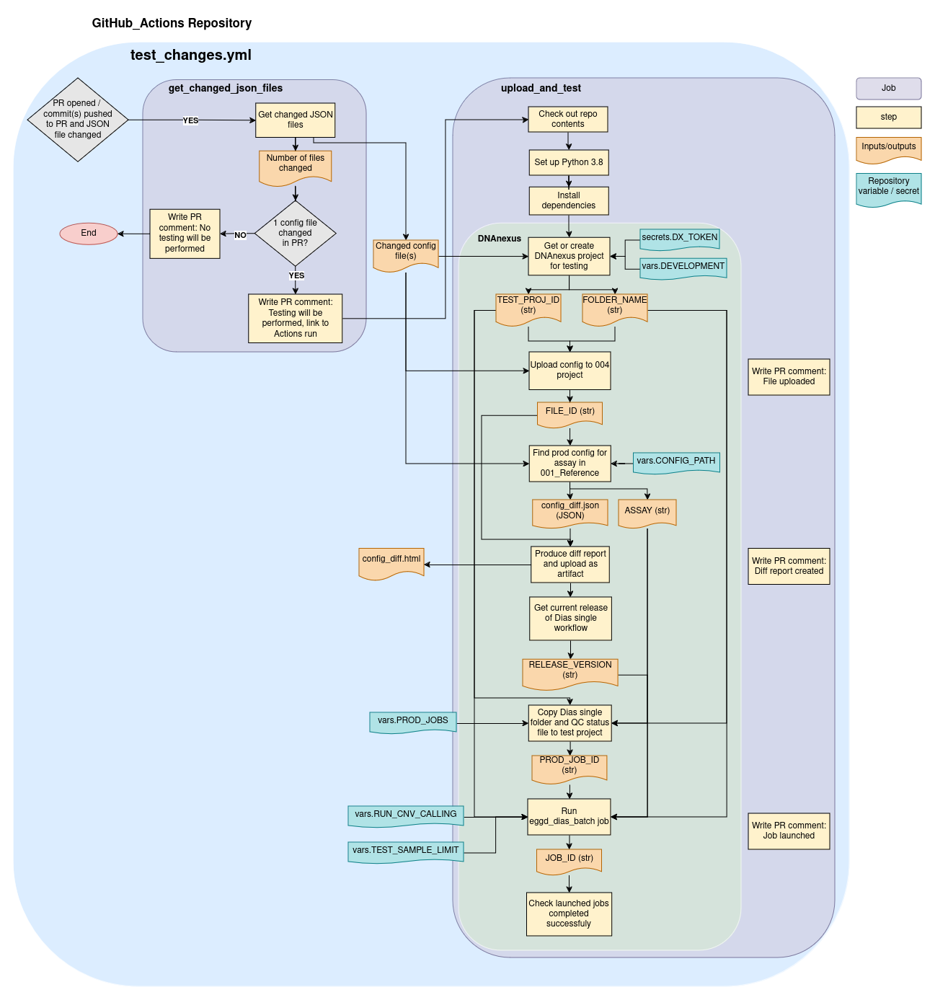

# GitHub_Actions
Repository to hold GitHub Actions automated workflows.

## Test changes workflow
### Introduction
This workflow is held in `.github/workflows/test_changes.yml` and automates some integration testing of Dias batch configuration files, which are used as input to the [eggd_dias_batch](https://github.com/eastgenomics/eggd_dias_batch) app.

### Pre-requisites
Certain secrets and variables must be set in each repository which holds the configuration file(s) ([egg4_dias_TWE_config](https://github.com/eastgenomics/egg4_dias_TWE_config) and/or [egg5_dias_CEN_config](https://github.com/eastgenomics/egg5_dias_CEN_config)), as these secrets/variables are used as inputs to the workflow. These can be set in each repository under `Settings/Secrets and variables/Actions/` by an organisation administrator.

#### Secrets

| Secret  | Type | Example | Description |
| --- | --- | --- | --- |
| DX_TOKEN  | `str` | `a1b2c3`  | Authorisation token for DNAnexus. Requires permissions to view, create projects, upload and run jobs.

#### Variables

| Variable  | Type | Example | Description  |
| --- | --- | --- | --- |
| CONFIG_PATH  | `str` | `project-Fkb6Gkj433GVVvj73J7x8KbV:/dynamic_files/dias_batch_configs` | The path in the 001_Reference DNAnexus project where production eggd_dias_batch configuration files are stored. |
| PROD_JOBS  | `str` | `'{"TWE": "job-GpfQ2fQ4fj3XG67xkbPFXKZg","CEN": "job-Gpbq1q847X23zF1568K3x3q8"}'` | DNAnexus job IDs for eggd_dias_batch jobs which were run in production 002 projects for each assay which will be re-run with the updated configuration file for testing. |
| TEST_SAMPLE_LIMIT  | `int` | `1` | The number of samples to set off reports jobs for with eggd_dias_batch. |
| RUN_CNV_CALLING  | `bool` | `True` | If `True` and the configuration file being updated is CEN, re-runs CNV calling and if `False` does not. If it is a CEN config being updated and `RUN_CNV_CALLING` is set to `False` (or a TWE config always), will re-use outputs from the CNV calling job which was launched by the original eggd_dias_batch job provided in `PROD_JOBS`. |
| DEVELOPMENT | `bool` | `False` | If True and a 004 DNAnexus project is searched for/created, includes `'GitHub_Actions_development_'` within its name. |
| WORKFLOW_BRANCH | `str` | `main` | The name of the branch of this GitHub_Actions repository to check out within the workflow. |

Note: all of these variables are treated as type string when given as inputs to the workflow.

### Running the workflow
#### Create YML file in caller repository
The workflow can be called from a separate GitHub repository by creating a YML file within that repository within a `.github/workflows` directory, which references this reusable workflow. This requires setting the GitHub Actions secrets and variables in the caller repository to pass them as inputs to the re-usable workflow. Example YML file:
```
name: Test dias batch configs

on:
  pull_request:
    paths:
      - '**/*.json'

jobs:
  test_config:
    uses: eastgenomics/GitHub_Actions/.github/workflows/test_changes.yml@<BRANCH_NAME>
    with:
      config_path: ${{ vars.CONFIG_PATH }}
      prod_jobs: ${{ vars.PROD_JOBS }}
      test_sample_limit: ${{ vars.TEST_SAMPLE_LIMIT }}
      run_cnv_calling: ${{ vars.RUN_CNV_CALLING }}
      development: ${{ vars.DEVELOPMENT }}
      workflow_branch: ${{ vars.WORKFLOW_BRANCH }}
    secrets:
      DX_TOKEN: ${{ secrets.DX_TOKEN }}
```

### Description
#### Workflow trigger
The workflow will run automatically when a pull request (PR) is opened (to any branch) within the separate caller Dias batch config repository and a JSON file has been updated in this PR. It will also re-run when a new commit is pushed to the HEAD ref of the PR while it is open.

###### Trigger caveats
If multiple pushes are made to the PR while the workflow is running, the previous workflow run will be cancelled so only one instance of the workflow is running at a time. The workflow will also terminate any jobs currently running in the DNAnexus 004 project which is created/found before running a new eggd_dias_batch job to prevent previous jobs being left running which use an outdated configuration file.

#### How it works
The workflow is held within the `test_changes.yml` file and consists of two jobs, each comprising steps:
- `get_changed_json_files`
  - This finds how many JSON files have been updated within the PR
    - If 1 JSON file has been updated, the `upload_and_test` workflow will be run.
    - If this is > 1, the `upload_and_test` job will not be run and the workflow will end.
      - This is because only one JSON file should exist in each Dias batch config repository. This also prevents any confusing behaviour which could be caused by creating projects and launching jobs for multiple JSON files.
- `upload_and_test`
  - Check out caller repository code (to access the JSON file(s) changed)
  - Check out this repository (to access the Python scripts the workflow references)
  - Set up Python
  - Install dependencies
  - Get or create 004 test project
    - If `DEVELOPMENT` set to True, `'GitHub_Actions_development_'` is added to the name of the project searched for/created.
    - A folder is also created in this project, named with the GitHub Actions run ID and a timestamp the workflow is run.
  - Upload changed JSON config file to testing project
  - Get production config in DNAnexus
    - Finds and returns the current highest version of the configuration file for the assay in the DNAnexus 001_Reference project, within the path set as `CONFIG_PATH`.
  - Generate diff report compared to production config.
    - This is uploaded as an artifact of the workflow run.
  - Get current release version of Dias single workflow
    - Get the current release tag from the Dias single workflow repository. This is so that we can check whether the jobs given in `PROD_JOBS` are using data which does not relate to the current Dias single version.
  - Copy test data to test project
    - Based on the job for the assay given in `PROD_JOBS`, copies over the whole Dias single folder (and the QC status file) which was used as input to the original eggd_dias_batch job in the 002 project. This is because eggd_artemis requires files to exist in the same project where it is run.
    - If these files already exist in the 004 project, these are moved to the folder for the current GitHub Actions workflow run.
  - Run tests in DNAnexus
    - Terminates any running/queued jobs in the 004 test project.
    - Based on the job for the assay given in `PROD_JOBS`, whether to re-run CNV calling set as `RUN_CNV_CALLING`, and the sample limit given in `TEST_SAMPLE_LIMIT`, the eggd_dias_batch job is re-run with the configuration file replaced to be the one we are updating.
  - Check jobs complete successfully
    - The GitHub Actions workflow will be held to check that all jobs launched in DNAnexus complete successfully. If this is the case, the workflow check passes successfully.

##### Workflow diagram:

